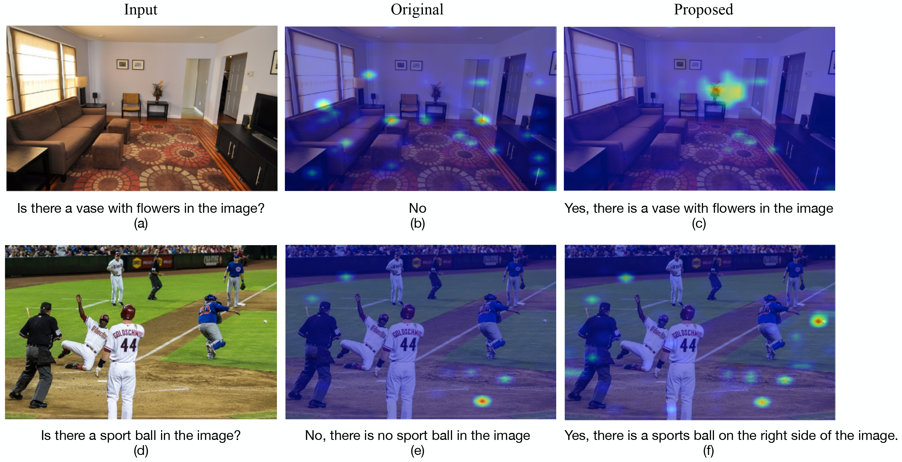
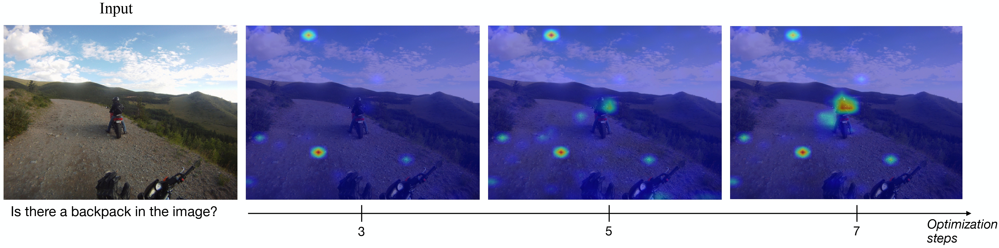

# Learning-to-Enhance-Modality-Usage-at-Inference-Time

Official PyTorch implementation of the paper "Learning to Enhance Modality Usage at Inference Time".

<h1 align="center">
  
  
</h1>
  <p align="center">
    <a href="https://www.linkedin.com/in/itai-allouche/">Itai Allouche</a> •
    <a href="https://keshet.technion.ac.il">Yossi Keshet</a>
  </p>

<h2 align="center">
# Learning to Enhance Modality Usage at Inference Time

> **Abstract:** *Multimodal large language models (MLLMs) have demonstrated strong capabilities 
>across vision and audio-language tasks, yet they remain prone to hallucinations,
>generating outputs that are inconsistent with the provided perceptual inputs.
>A key factor underlying this behavior is an imbalance in modality utilization during
>inference, where textual tokens dominate the generation process while perceptual
>tokens are under-utilized, leading the model to rely on linguistic priors rather than
>grounded evidence. To address this issue, we propose Learning Inference-time
>Modality Enhancement (LIME), a training-free framework that improves multimodal grounding by
>explicitly enhancing modality usage during decoding. LIME leverages Layer-wise Relevance Propagation (LRP)
>to quantify token-level contributions and defines a relevance-based objective that promotes increased reliance
>on perceptual inputs. This objective is enforced through an inference-time updates
>to the model’s key-value representations, without modifying model parameters or
>requiring additional training data. We evaluate LIME across multiple multimodal
>benchmarks in both vision and audio domains, demonstrating consistent reduc-
>tions in hallucination and improved grounding while preserving generation quality.
>Further analysis shows that LIME increases modality contribution and produces
>more localized and semantically aligned relevance patterns.*
</h2>

## Setup

### Prerequisites
- Python 3.11+
- PyTorch 2.1.2
- CUDA 12.0 (optional, CPU support available)

### Installation

Install uv on your machine, see intrucitons [here](https://docs.astral.sh/uv/getting-started/installation/).

Clone and setup the repository:

```bash
git clone https://github.com/ItaiAllouche/lime.git
cd lime
uv sync

# activate the environment
source .venv/bin/activate
```

## CLI Usage (example for llava)
```bash
cd playgrounds
uv vlm.py \
    --model llava \
    --prompt "What is in this image?" \
    --image_path path/to/image \
    --device_num 0 \
    --max_new_tokens 50
```

## Python Usage (example for qwen2audio)
```python
import torch
from models.qwen2_audio import Qwen2AudioLIME

# initialize model
device = "cuda:0" if torch.cuda.is_available() else "cpu"
model = Qwen2AudioLIME(verbose=True).to(device, dtype=torch.bfloat16)

# prepare inputs
inputs = model.get_inputs_for_forward(
    instruction="What do you hear in this audio?",
    wav_path="path/to/audio/file",
    device_num=0
)

# generate with LIME
output = model.generate(
    inputs=inputs,
    opt_steps=7,
    opt_lr=0.0005,
    lambda_kl=0.007,
    max_new_tokens=50,
    plot=False
)

print(f"Response: {output['response']}")
```
