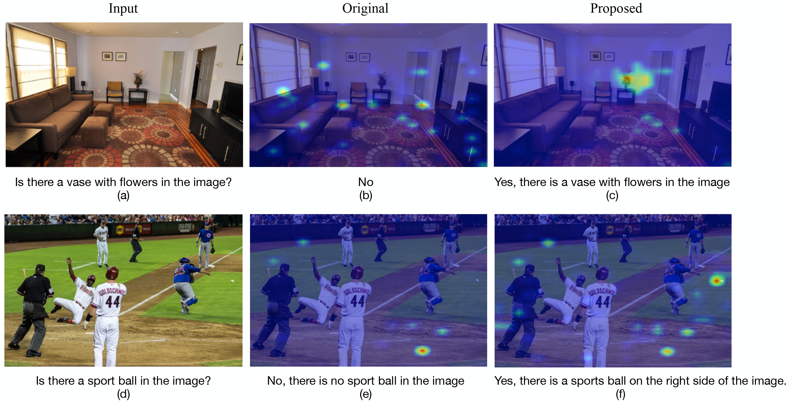
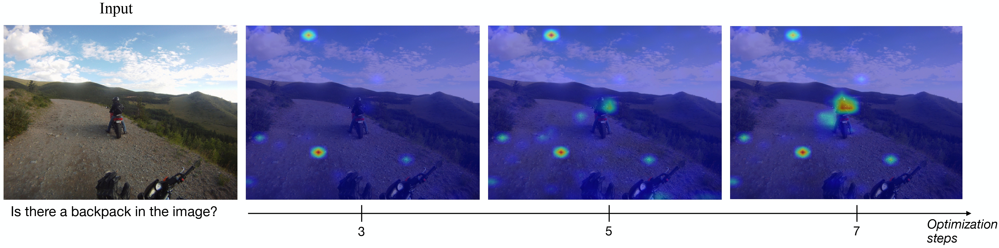

# Official PyTorch Implementation Of The Paper "Mitigating Multimodal LLMs Hallucinations via Relevance Propagation at Inference Time"

<h1 align="center">
  
  
</h1>

<p align="center">

> <strong>Abstract.</strong> *Multimodal large language models (MLLMs) achieve strong performance on vision- and audio-language tasks, yet can generate outputs that diverge from the provided perceptual inputs, commonly referred to as multimodal hallucinations. Prior work has associated such hallucinations with an imbalance in perceptual utilization, where textual information can dominate perceptual evidence and bias generation toward language priors. While previous work used heuristics to correct this imbalance, we take a different route by using Layer-wise Relevance Propagation (LRP), which directly decomposes predictions into relevance scores over the input tokens, to both analyze this behavior and propose a mitigation. First, we examine whether this imbalance contributes to hallucinations and show that hallucinations often coincide with reduced perceptual relevance and, crucially, that intervening on this relevance changes prediction behavior. We further leverage LRP and propose a training-free framework that shifts relevance toward perceptual tokens by optimizing key-value representations during decoding, without modifying model parameters or requiring training data. We call this method Learning Inference-time Modality Enhancement (LIME). Despite using no spatial or temporal supervision, LIME concentrates relevance on query-relevant regions. We evaluate LIME across multiple multimodal benchmarks in both vision and audio domains, demonstrating consistent reductions in hallucinations and enhanced grounding while preserving generation quality.*
</p>

## Setup

### Prerequisites
- Python 3.11+
- PyTorch 2.1.2
- CUDA 12.0 (optional, CPU support available)

### Installation

Install uv on your machine, see intrucitons [here](https://docs.astral.sh/uv/getting-started/installation/).

Clone and setup the repository:

```bash
# clone cmd
cd lime
uv sync
```

## Inference

We provide both CLI and Python interfaces for running inference with LIME.

### CLI Usage (example for LLaVA)

```bash
cd playgrounds
uv run vlm.py \
    --model llava \
    --prompt "What is in this image?" \
    --image_path path/to/image \
    --device_num 0 \
    --max_new_tokens 50
```

### Python Usage (example for Qwen2Audio)
```python
import torch
from models.qwen2_audio import Qwen2AudioLIME

# initialize model
device = "cuda:0" if torch.cuda.is_available() else "cpu"
model = Qwen2AudioLIME(verbose=True).to(device, dtype=torch.bfloat16)

# prepare inputs
inputs = model.get_inputs_for_forward(
    instruction="What do you hear in this audio?",
    wav_path="path/to/audio/file",
    device_num=0
)

# generate with LIME
output = model.generate(
    inputs=inputs,
    max_new_tokens=50,
    verbose=False
)

print(f"Response: {output['response']}")
```
## TODO

- [ ] Add SALMONN implementation  
  *(Not yet included due to environment constraints — SALMONN depends on a specialized setup that is currently incompatible with the rest of the repository.)*
- [ ] Add citation
- [ ] Add ArXiv patch  

## License

This project is licensed under the Apache License 2.0. See the [LICENSE](LICENSE) file for details.

[](LICENSE)
